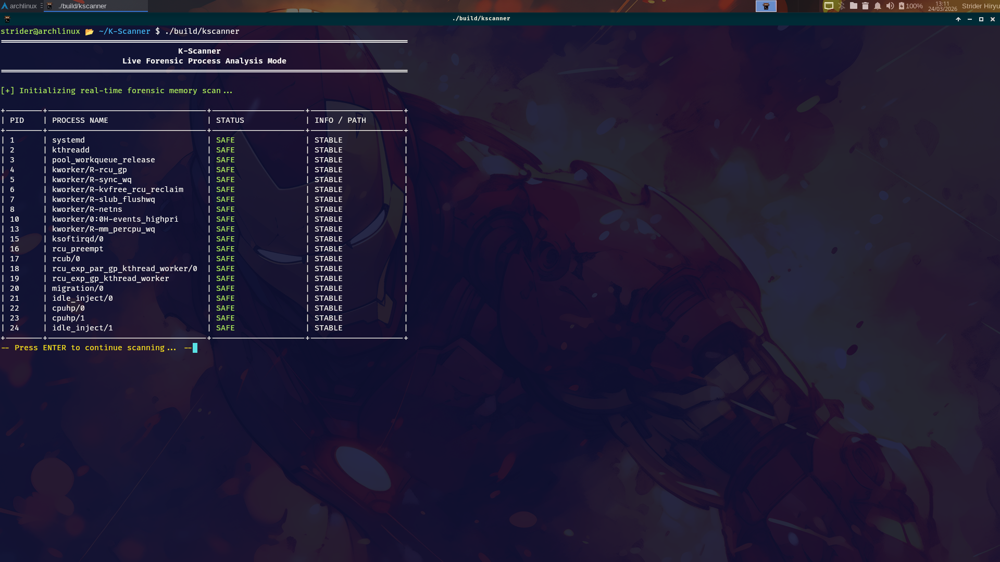
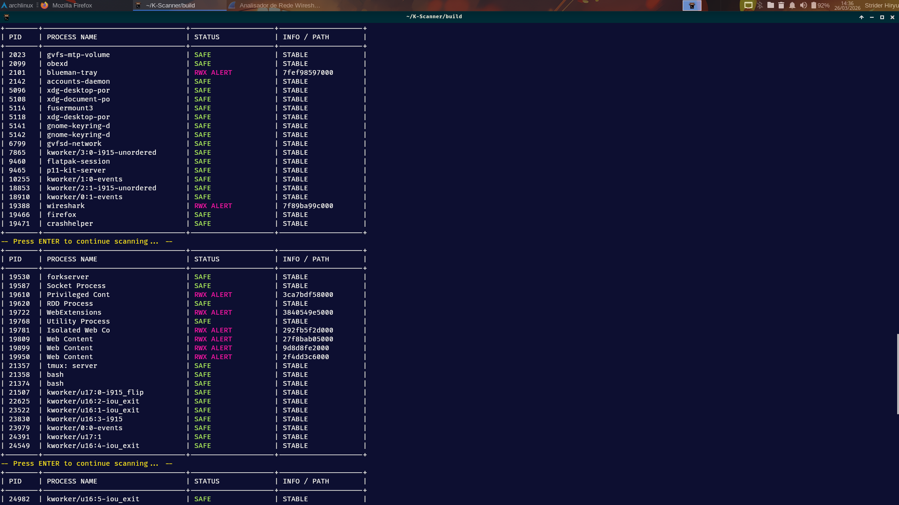
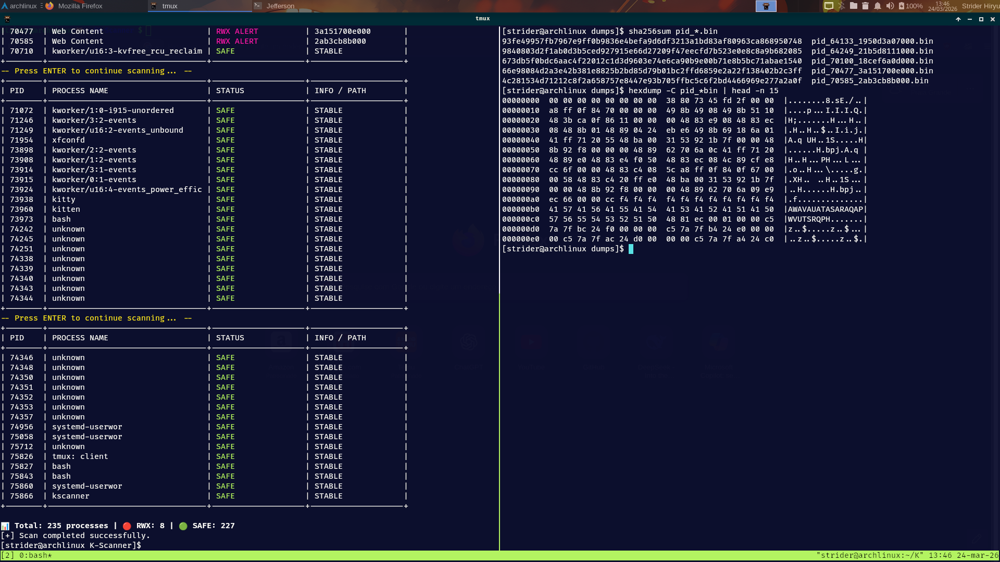

# 🐧 K-Scanner

Lightweight Linux memory auditing tool focused on RWX detection and forensic triage.

---

## ● Overview

K-Scanner is a minimal forensic utility designed to audit memory protection flags of active Linux processes.

It analyzes the `/proc` virtual filesystem to identify memory regions that violate the W^X (Write XOR Execute) security principle — a condition commonly associated with:

- Shellcode injection
- JIT-compiled regions
- Packed executables
- Fileless malware techniques

The project is written in pure C (C99) with emphasis on performance, clarity, and forensic integrity.

---

## ● Why

Modern Linux systems rely heavily on memory protection mechanisms.

However, visibility into runtime RWX memory regions is not centralized.

K-Scanner provides:

- Deterministic RWX detection
- System-wide process inspection
- Live forensic triage support
- Lightweight incident response tooling

It focuses strictly on observable memory metadata.

---

## ● How It Works

K-Scanner parses:

```bash
/proc/[PID]/maps
```

For each running process, it inspects memory segments and evaluates their permission flags.

If a memory region simultaneously contains:

- W (Write)
- X (Execute)

an RWX alert is triggered.

The scanner operates through read-only metadata inspection and does not rely on intrusive debugging mechanisms such as `ptrace`.

---

## ● Example Output

```text
PID    USER    STATUS
1023   root    SAFE
2045   www     ALERT (RWX region detected)
```
---

## ● Project in Action


*1- Live system-wide RWX memory scan*


*2- RWX region detection with alert classification*


*3- Forensic memory extraction and integrity verification*

---

## ● Features

- System-wide PID scanning
- RWX memory detection engine
- SAFE / ALERT classification
- Clean terminal output
- Low memory footprint
- Designed for forensic triage scenarios

---

## ● Design Philosophy

K-Scanner was built around three principles:

1. Simplicity  
   No kernel modules, no injection, no process suspension.

2. Forensic Integrity  
   The scanner does not modify process memory or execution state.

3. Performance  
   Optimized C implementation for minimal overhead during live analysis.

---

## ● Limitations

- RWX detection alone does NOT confirm malicious activity.
- Some legitimate applications (e.g., JIT engines) may allocate RWX regions.
- Elevated privileges may be required to inspect certain processes.
- Does not perform full memory content inspection by default.
- Tested primarily on Arch Linux (Kernel 6.x).

---

## ● Investigation Workflow

After detecting an RWX region, analysts may proceed with:

Binary validation:

sha256sum /proc/[PID]/exe

Advanced memory extraction (use cautiously):

sudo dd if=/proc/[PID]/mem of=dump.bin bs=1 skip=<offset> count=<size>

String inspection of dumps to identify suspicious artifacts.

---

## ● Deployment

### Requirements

- Linux OS
- gcc
- make
- sudo privileges

### Build and Execute
```bash
git clone https://github.com/jeffersoncesarantunes/K-Scanner.git
cd K-Scanner
make clean && make
sudo ./build/kscanner

```

---

## ● Tech Stack

- Language: C (C99)
- Data Source: `/proc` filesystem
- Build Tool: GNU Make
- Target: Linux Kernel 4.x / 5.x / 6.x

---

## ● Roadmap

- RWX detection engine (Completed)
- Structured output format (Completed)
- JSON export for SIEM integration
- Interactive TUI interface
- Automated memory dump for flagged PIDs
- Multi-threaded scan optimization
- Kernel telemetry research

---

## ● License

Distributed under the MIT License.  
See LICENSE for details.

Developed as a practical exploration of Linux memory internals and live forensic analysis techniques.

