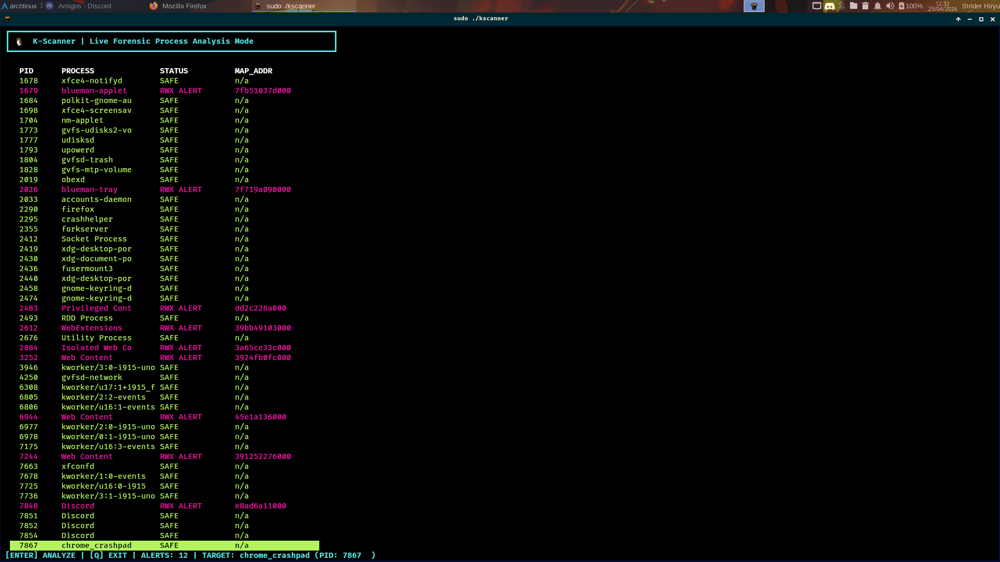
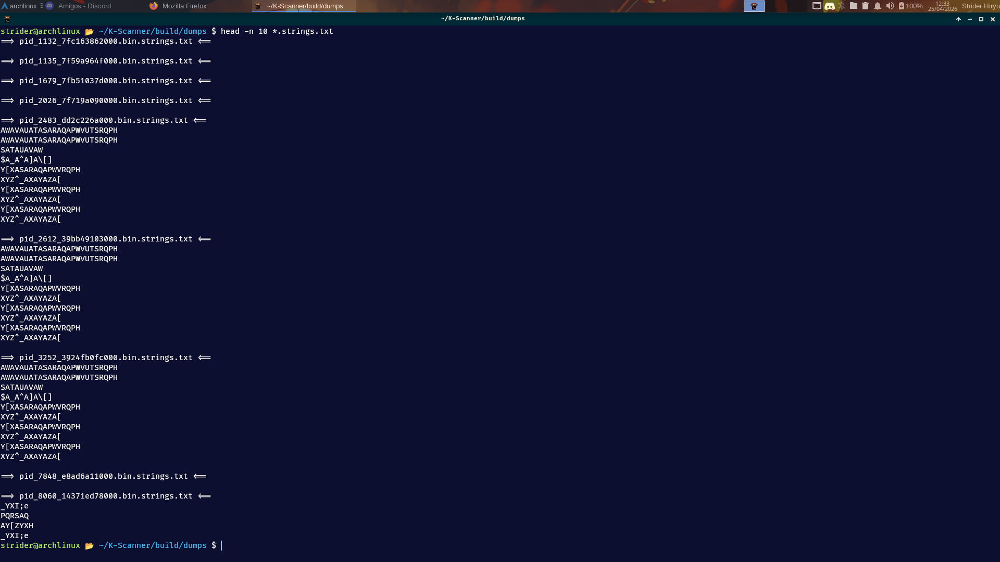
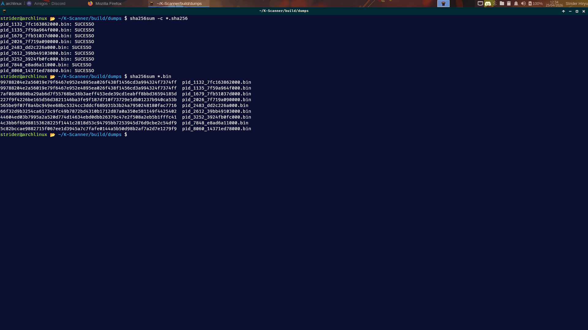

# K-Scanner

Lightweight Linux memory auditing tool focused on RWX detection and automated forensic triage.


[](https://kernel.org)
[](https://gcc.gnu.org/)
[](LICENSE)
[](#-roadmap)
[](https://github.com/jeffersoncesarantunes/K-Scanner/actions/workflows/ci.yml)
[](https://github.com/jeffersoncesarantunes/K-Scanner/actions/workflows/codeql.yml)
[](Dockerfile)
[](https://security.archlinux.org/)
[](./docs/forensic_methodology.md)


---

## Etymology & Origin

The name **K-Scanner** comes from the Linux **Kernel** — it's all about inspecting runtime memory behavior and surfacing anomalous execution patterns. The "K" is a nod to the kernel, the core OS component this tool leans on to scan process memory maps and catch RWX violations at the system level.


---

## Overview

K-Scanner is a lightweight forensic utility that inspects active Linux processes for memory regions violating the **W^X (Write XOR Execute)** security principle.

Written in pure **C99**, it pairs a high-performance scanning engine with an interactive **ncurses-based Brutalist TUI** so you can navigate processes, spot RWX regions, and extract forensic evidence in real time.

Common RWX scenarios you'll run into:


* Shellcode injection
* Reflective payload loading
* Fileless malware execution
* JIT-compiled engines (Firefox, Python, Node.js, Discord)


---

## Features


* Interactive ncurses-based TUI
* Real-time RWX memory detection
* One-key forensic extraction
* Automatic SHA256 integrity hashing
* Automatic strings report generation
* Automatic hexadecimal preview generation
* **Automatic x86-64 disassembly** (native object dump)
* **Shellcode pattern detection** (NOP sleds, syscall, JMP gadgets, ROP, /bin/sh)
* SAFE / RWX ALERT classification
* **Confidence-based alert levels** (LOW / MEDIUM / CRITICAL)
* **JIT engine detection** (V8, SpiderMonkey, LuaJIT, Mono, .NET, JVM, Dart)
* **`--silent-jit` flag** to suppress JIT false positives
* **`--watch` headless continuous monitoring** (2-second cycles, alerts only + summary)
* **PKGBUILD** / AUR package available
* **Container-aware detection** — identifies Docker, Kubernetes, and LXC processes via cgroup
* **`--yara <rule.yara>`** — scan forensic dumps against YARA rules (requires `yara`)
* Low-overhead live analysis
* Live regex memory hunting (`--live <PID> <pattern>`)
* eBPF real-time RWX telemetry (`--bpf`, requires root + libbpf)
* **eBPF full syscall coverage** — `mmap`, `mprotect`, `shmat` (`SHM_EXEC`), `execve`


---

## Example Output

```text
 PID    PROCESS              STATUS       CONFIDENCE  MAP_ADDR
 1132   python3              RWX ALERT    LOW         7fc163862000
 1135   fail2ban-server      RWX ALERT    CRITICAL    7f59a964f000
 1426   Xorg                 SAFE         SAFE        n/a

 [ENTER] ANALYZE | [Q] EXIT | ALERTS: 12 | BPF: OFF
```


---

## How It Works

K-Scanner continuously reads `/proc/[PID]/maps` to find memory regions and inspect their permission flags.

The audit flow looks like this:


1. Parse `/proc/[PID]/maps`
2. Identify memory permissions (R / W / X)
3. Detect RWX violations (W^X policy breach)
4. Classify process behavior
5. Trigger forensic extraction pipeline


### Understanding RWX Alerts

Not every RWX region is malicious — context matters.


* **Expected JIT Behavior:** Browsers, Python, Node.js, and Electron apps may allocate RWX memory for JIT compilation
* **Suspicious Activity:** Anonymous executable pages or RWX regions in non-JIT processes
* **Forensic Priority:** Unexpected mappings should be dumped and analyzed first


---

## Build and Run

```bash
# Clone the repository
git clone https://github.com/jeffersoncesarantunes/K-Scanner.git
cd K-Scanner

# Build the project (BPF object + main binary)
make clean && make bpf && make

# Run automated tests
make test

# Install system-wide (binary + BPF object)
sudo make install

# --- Usage ---

# Help
./kscanner --help

# Standard execution (TUI)
sudo ./kscanner

# Suppress JIT engine false positives (browsers, Node.js, etc.)
sudo ./kscanner --silent-jit

# JSON/CSV export (headless)
sudo ./kscanner --json
sudo ./kscanner --csv

# Live regex memory hunting
sudo ./kscanner --live <PID> '<regex>'

# eBPF real-time RWX monitoring
sudo ./kscanner --bpf

# Continuous headless monitoring (2-second cycles, Ctrl+C to exit)
sudo ./kscanner --watch

# Continuous monitoring in JSON-Lines format
sudo ./kscanner --watch --json

# TUI mode with YARA rule scanning on forensic dumps
sudo ./kscanner --yara /path/to/rules.yara

# TUI with BPF telemetry + YARA + container awareness (all flags combined)
sudo ./kscanner --bpf --silent-jit --yara myrules.yara

# Uninstall
sudo make uninstall
```

### YARA Rule Scanning

[YARA](https://virustotal.github.io/yara/) is a pattern-matching engine for identifying malware samples. When you pass `--yara`, K-Scanner runs your YARA rules against forensic memory dumps to look for known threat patterns.

```bash
# Install YARA (optional, required for --yara)
sudo pacman -S yara
```


---

## Investigation & Post-Analysis Workflow

Once you've spotted an RWX region, you can grab and verify volatile evidence right away.


### 1. Live Memory Acquisition

Find the suspicious process and hit `ENTER`.

K-Scanner will automatically:


* Dump the RWX region
* Generate SHA256 checksum
* Extract printable strings
* Produce a hexadecimal preview


### 2. Integrity Verification

```bash
cd build/dumps
sha256sum -c *.sha256
```

### 3. Rapid Triage

```bash
grep -iE "http|ssh|cmd|bash|token|pass" *.strings.txt
```

### 4. Binary Inspection

```bash
head -n 20 *.hex.txt
```

### 5. Full Artifact Set

Each memory extraction produces:


* Raw binary dump (`.bin`)
* SHA256 checksum (`.sha256`)
* Extracted strings (`.strings.txt`)
* Hexadecimal preview (`.hex.txt`)
* x86-64 disassembly listing (`.disasm.txt`)
* Shellcode pattern analysis (`.shellcode.txt`)
* YARA rule matches (`.yara.txt`, when `--yara` is active)


---

## Why

Detecting executable writable memory on Linux is still a fragmented, mostly manual process.

K-Scanner pulls all that together by giving you:


* Deterministic RWX detection
* Interactive live process inspection
* Automated forensic evidence collection
* Immediate triage-ready artifacts
* Minimal operational overhead

It turns raw `/proc` telemetry into something you can actually act on during incident response.


---

## Project in Action



*Live forensic mode identifying RWX memory regions in real-time.*



*Memory triage with automatic extraction of relevant strings.*



*Evidence preservation with SHA-256 integrity validation.*


---

## Operational Integrity

K-Scanner was built for safe live-response work:


* Passive / read-only analysis
* No process injection
* Controlled memory dumping
* Automatic evidence integrity validation


---

## Deployment

### Requirements


* Linux Kernel 5.x or newer
* gcc
* make
* ncurses
* binutils
* coreutils
* yara (optional, required for `--yara` flag)
* UTF-8 compatible terminal
* Root privileges

### Optional (eBPF telemetry)


* libbpf (runtime + build-time)
* Clang (build-time, for BPF compilation)
* Kernel BTF (`/sys/kernel/btf/vmlinux`)
* `CONFIG_BPF`, `CONFIG_BPF_SYSCALL`, `CONFIG_DEBUG_INFO_BTF` enabled


---

## Repository Structure

```text
├── bin/
│   └── kscanner

├── build/
│   ├── bpf/
│   ├── dumps/
│   └── obj/

├── docs/
│   ├── architecture.md
│   ├── forensic_methodology.md
│   ├── performance_and_limitations.md
│   ├── threat_model.md
│   └── use_cases.md

├── examples/
│   └── usage.md

├── Images/
│   ├── kscanner1.png
│   ├── kscanner2.png
│   └── kscanner3.png

├── include/

├── scripts/
│   ├── build.sh
│   ├── diagnostic.sh
│   ├── run_tests.sh
│   └── setup_dev_env.sh

├── src/
│   ├── bpf/
│   ├── core/
│   └── modules/

├── tests/
│   └── cases.md

├── PKGBUILD

├── LICENSE

├── Makefile

└── README.md
```


---

## Tech Stack


* **Language:** C99
* **Interface:** ncurses
* **Data Source:** `/proc`, `raw_tp/sys_enter` (eBPF)
* **Telemetry:** eBPF + libbpf (optional, requires kernel BTF)
* **Hashing:** SHA256
* **Build Tool:** GNU Make + Clang (for BPF)
* **Target:** Linux Kernel 5.x / 6.x


---

## Roadmap


* [x] Modular C Engine
* [x] Interactive ncurses TUI
* [x] Automated Memory Dump
* [x] SHA256 Integrity Validation
* [x] Automated Strings/Hex Triage
* [x] JSON/CSV Export
* [x] Live Regex Memory Hunting (`--live`)
* [x] eBPF Real-time RWX Telemetry (`--bpf`)
* [x] **Confidence-based alert classification** (LOW / MEDIUM / CRITICAL)
* [x] **JIT engine auto-detection** (V8, SpiderMonkey, LuaJIT, .NET, JVM, Dart)
* [x] **`--silent-jit`** — suppress JIT false positives
* [x] **eBPF full syscall coverage** — `mmap`, `mprotect`, `shmat` (`SHM_EXEC`), `execve`
* [x] **Disassembly + shellcode detection** (objdump + pattern scanning)
* [x] YARA rule-based detection pattern matching (`--yara <rule.yara>`)
* [x] Container-aware deep inspection (Docker/k8s/LXC cgroup correlation)
* [ ] Multi-process coordinated attack scenarios
* [ ] Remote API / gRPC endpoint for SIEM integration


---

## Documentation

[](./docs/architecture.md)
[](./docs/forensic_methodology.md)
[](./docs/threat_model.md)
[](./docs/performance_and_limitations.md)
[](./docs/use_cases.md)


