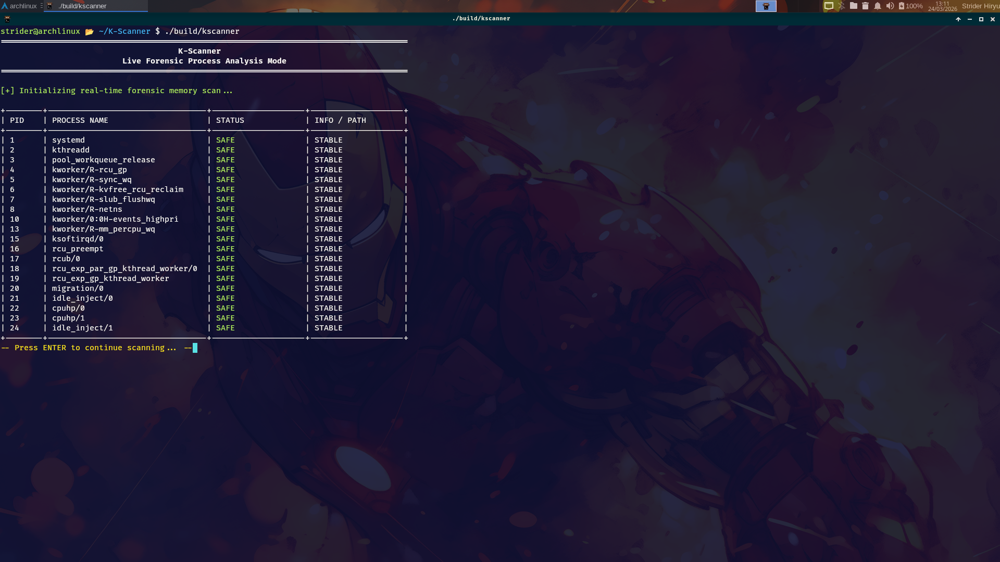
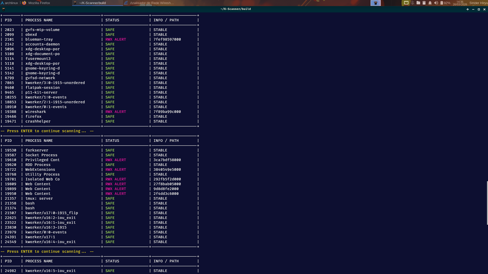
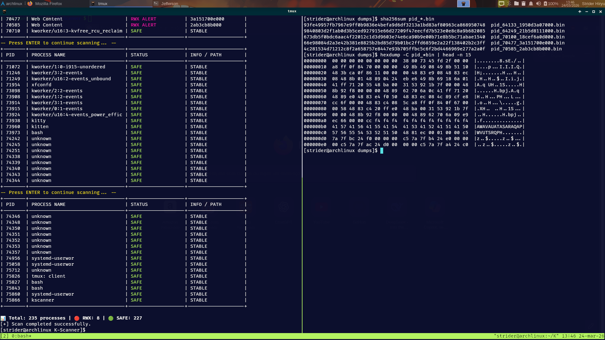

# 🐧 K-Scanner

Lightweight Linux memory auditing tool focused on RWX detection and forensic triage.

[](https://kernel.org)
[](https://gcc.gnu.org/)
[](LICENSE)


## ● Project Information

- **Project:** K-Scanner (Kernel-level Security Scanner)
- **Author:** Jefferson Cesar Antunes
- **License:** MIT
- **Version:** 1.0.0
- **Description:** Active Security Auditing & Hardening Tool for Linux Systems.

## ● Etymology & Origin

The name **K-Scanner** was born from the project's focus on the **Kernel** (the heart of the Linux Operating System).

The "K" symbolizes the tool's mission to dive deep into system-level configurations, permissions, and sensitive files. It acts as a sentinel, scanning the "foundations" (Kernel-space and System-space) to ensure that the base of the OS is hardened against potential threats.

## ● Overview

K-Scanner is a minimal forensic utility designed to audit memory protection flags of active Linux processes.

It analyzes the `/proc` virtual filesystem to identify memory regions that violate the W^X (Write XOR Execute) security principle — a condition commonly associated with:

- Shellcode injection
- JIT-compiled regions
- Packed executables
- Fileless malware techniques

The project is written in pure C (C99) with emphasis on performance, clarity, and forensic integrity.

## ● Why

Modern Linux systems rely heavily on memory protection mechanisms. However, visibility into runtime RWX memory regions is not centralized.

K-Scanner provides:

- Deterministic RWX detection
- System-wide process inspection
- Live forensic triage support
- Lightweight incident response tooling

It focuses strictly on observable memory metadata.

## ● How It Works

K-Scanner parses the virtual maps of active processes:
```bash
/proc/[PID]/maps
```

For each running process, it inspects memory segments and evaluates their permission flags. If a memory segment contains both **Write (W)** and **Execute (X)** permissions simultaneously, an RWX alert is triggered.

The scanner operates through read-only metadata inspection and does not rely on intrusive debugging mechanisms such as `ptrace`.

## ● Example Output

```text
┌────────┬──────────────────────────────────┬────────────────────┬────────────────────┐
│  PID   │ PROCESS NAME                     │ STATUS             │ MEM ADDRESS        │
├────────┼──────────────────────────────────┼────────────────────┼────────────────────┤
│ 2327   │ xdg-desktop-por                  │ SAFE               │ 0x00000000         │
│ 2378   │ Privileged Cont                  │ RWX ALERT          │ 38113397b000       │
│ 2497   │ WebExtensions                    │ RWX ALERT          │ 1dcb66314000       │
│ 2557   │ Isolated Web Co                  │ RWX ALERT          │ 3da6521ae000       │
│ 2708   │ Web Content                      │ RWX ALERT          │ 32071f8e1000       │
│ 3021   │ bash                             │ SAFE               │ 0x00000000         │
└────────┴──────────────────────────────────┴────────────────────┴────────────────────┘
```

## ● Project in Action


*1- Automated baseline evaluation of global memory posture.*


*2- Real-time detection of memory regions violating W^X principles.*


*3- Forensic audit reporting and risk assessment for flagged PIDs.*

## ● Features

- System-wide PID scanning
- RWX memory detection engine
- SAFE / ALERT classification
- Clean terminal output
- Low memory footprint
- Designed for forensic triage scenarios

## ● Operational Integrity

K-Scanner is built for stability and forensic neutrality:

1. **Simplicity:** No kernel modules, no injection, no process suspension.
2. **Forensic Integrity:** Does not modify process memory or execution state.
3. **Performance:** Optimized C implementation for minimal overhead during live analysis.
4. **Passive Inspection:** Uses read-only metadata via /proc.

## ● Investigation Workflow

After detecting an RWX region, analysts may proceed with:

1. **Binary Validation**
```bash
sha256sum /proc/[PID]/exe
```

2. **Advanced Memory Extraction**
```bash
sudo dd if=/proc/[PID]/mem of=dump.bin bs=1 skip=<offset> count=<size>
```

3. **Artifact Inspection**

Use `strings` or `hexdump` on the generated dump to identify suspicious payloads.

## ● Post-Analysis of Forensic Dumps

Once **K-Scanner** identifies a suspicious **RWX** region, it automatically extracts its raw content to the `build/dumps/` directory. These artifacts are essential for offline forensic investigation.

#### 1. Integrity Verification (Hashing)

To ensure the forensic evidence hasn't been tampered with and to maintain a chain of custody, generate a SHA-256 hash:
```bash
sha256sum build/dumps/pid_XXXX_XXXX.bin
```

2. **Hexadecimal Inspection**

To identify instruction patterns, headers, or NOP sleds, use a hex dumper:
```bash
hexdump -C build/dumps/pid_XXXX_XXXX.bin | head -n 20
```

3. **String Extraction**

Search for human-readable indicators such as URLs, IP addresses, or obfuscated commands:

strings build/dumps/pid_XXXX_XXXX.bin | less

## ● Deployment

**Requirements:**

- Linux OS (Tested on Arch Linux 6.x)
- gcc & make
- sudo privileges

## ● Build and Run

```bash
# Clone the repository
git clone https://github.com/jeffersoncesarantunes/K-Scanner.git

# Enter the project directory
cd K-Scanner

# Build the project
make

# Run the scanner (requires root privileges)
sudo ./build/kscanner
```

## ● Repository Structure

```text
├── build/              # Compiled objects and binaries (Ignored by .gitignore)
│   └── obj/            # Modular object files (.o)
├── docs/               # Architecture, Methodology and Threat Model
├── examples/           # Usage guides and sample scenarios
├── Imagens/            # K-Scanner screenshots and execution flow
├── include/            # Header files (.h) - Interface definitions
├── scripts/            # Automation (Build, Diagnostic and CI/CD)
├── src/                # Core implementation (.c)
│   ├── core/           # Main engine, Memory analyzer and Process hunter
│   ├── modules/        # Advanced forensic features
│   └── utils/          # Logging and memory utilities
├── tests/              # Test cases and validation logic
├── .gitignore          # Prevents leaking binaries and memory dumps
├── Makefile            # Advanced build system (Automatic directory creation)
└── README.md           # Project entry point and manual
```

## ● Tech Stack

- **Language:** C (C99)
- **Data Source:** /proc filesystem
- **Build Tool:** GNU Make
- **Target:** Linux Kernel 4.x / 5.x / 6.x

## ● Roadmap

- [x] **Modular C Engine:** High-performance RWX detection logic.
- [x] **Advanced Build System:** POSIX-compliant Makefile with auto-directory creation.
- [x] **Structured Output:** Clean terminal reporting for forensic triage.
- [x] **Automated Memory Dump:** Integrated extraction for flagged PIDs (Local `.bin` output).
- [ ] **JSON/CSV Export:** Facilitate integration with SIEM and external auditing tools.
- [ ] **Interactive TUI:** Terminal User Interface for live process monitoring.

## ● License

Distributed under the MIT License. See [LICENSE](./LICENSE) for details.
